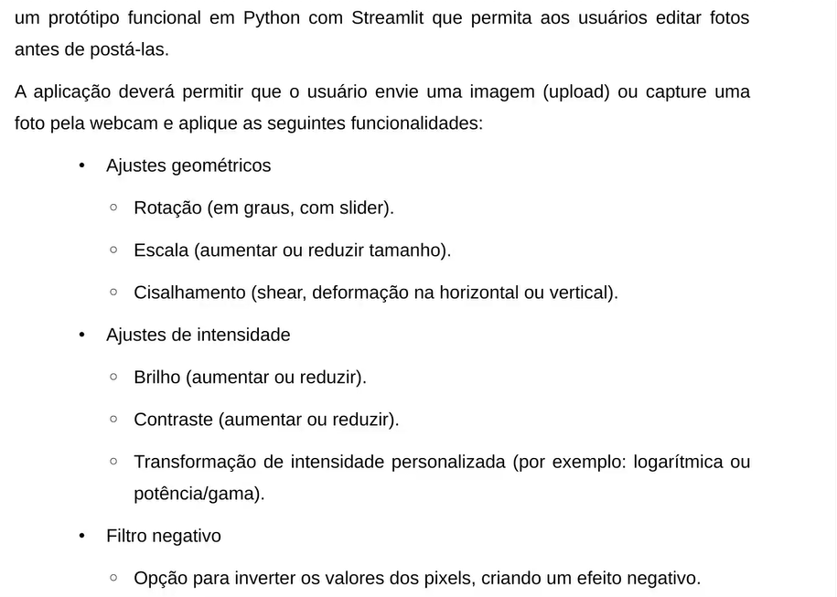

# 🖼️ Editor de Fotos com Streamlit – Atividade 2 (Visão Computacional)

Este projeto é um protótipo funcional desenvolvido em **Python com Streamlit**, que permite aos usuários editar fotos antes de postá-las, realizando transformações geométricas e de intensidade, além de aplicar filtros.

---

## 📸 Enunciado da Atividade


<sub>Figura 1 – Requisitos funcionais do editor (atividade de Visão Computacional).</sub>

---

## ✅ Requisitos da Aplicação

A aplicação deve permitir que o usuário envie uma imagem (upload) ou capture uma foto pela webcam e aplique as seguintes funcionalidades:

### 🔁 Ajustes geométricos:
- **Rotação** (em graus, com slider)
- **Escala** (aumentar ou reduzir tamanho)
- **Cisalhamento** (*shear*, deformação na horizontal ou vertical)

### 💡 Ajustes de intensidade:
- **Brilho** (aumentar ou reduzir)
- **Contraste** (aumentar ou reduzir)
- **Transformação de intensidade personalizada**  
  (por exemplo: logarítmica ou potência/gama)

### 🎞️ Filtro negativo:
- Opção para inverter os valores dos pixels, criando um efeito negativo

---

## ▶️ Como executar

### 1. Clone o repositório

```bash
git clone https://github.com/unimedapucarana/POS_IA_SENAI.git
cd editor-fotos-streamlit
```

### 2. Crie e ative o ambiente virtual

```bash
python -m venv visaoComputacional-ATIVIDADE2
# Windows
visaoComputacional-ATIVIDADE2\Scripts\activate
# Linux/macOS
source visaoComputacional-ATIVIDADE2/bin/activate
```

### 3. Instale as dependências

```bash
pip install -r requirements.txt
```

### 4. Execute a aplicação

```bash
streamlit run editor_fotos.py
```

---

## 📂 Estrutura do Projeto

```
editor-fotos-streamlit/
│
├── editor_fotos.py            # Código principal do editor
├── requirements.txt           # Lista de dependências
├── README.md                  # Documentação do projeto
└── docs/
    └── enunciado.png          # Imagem da atividade (enunciado)
```

---

## 💻 Tecnologias Utilizadas

- Python
- Streamlit
- OpenCV (`opencv-python-headless`)
- NumPy
- Pillow (PIL)

---

## 📬 Contato

Gleysson Bettin – [LinkedIn](hhttps://br.linkedin.com/in/gleyssonbettin)  
Projeto acadêmico para a disciplina de **Visão Computacional / Inteligência Artificial**
